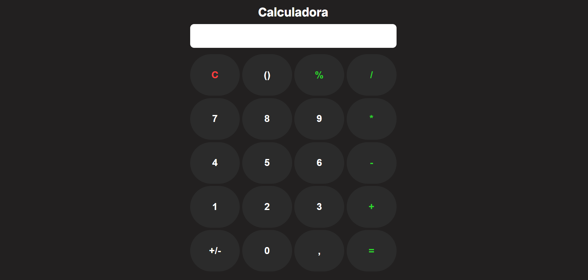
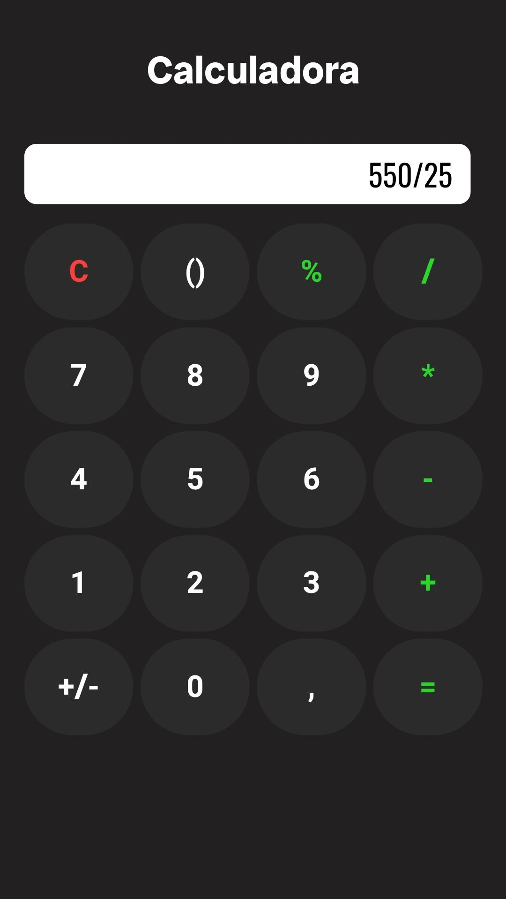

# Simple Calculator

A simple calculator developed using HTML, CSS, and JavaScript.

## Features

- Addition, subtraction, multiplication, and division of numbers.
- Percentage calculation.
- Support for parentheses for grouping expressions.
- Quick clearing of the input field.
- User-friendly and responsive interface.

## How to Use

1. Download or clone this repository to your computer.
2. Open the `index.html` file in any web browser.
3. Use the buttons to input numbers and operators.
4. Click "=" to get the result of the expression.
5. Use the "C" button to clear the input field.
